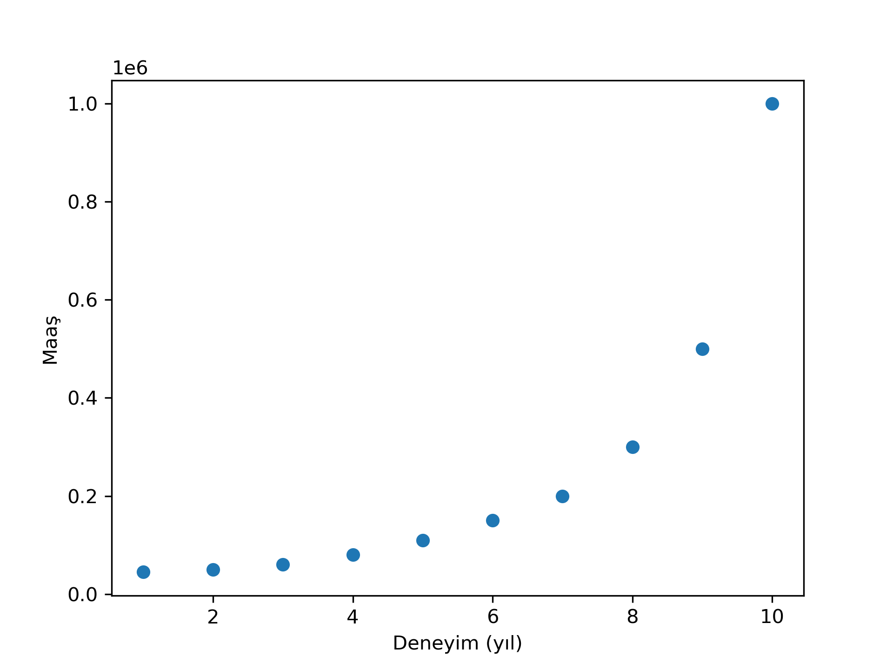
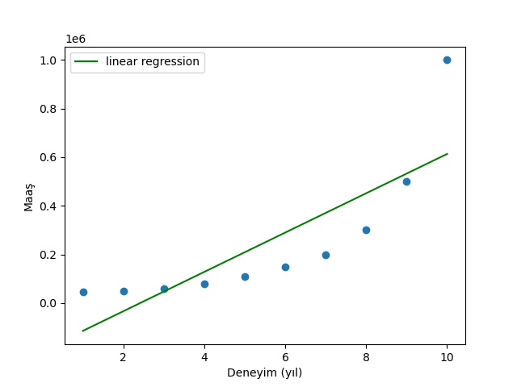

Proje Özeti
Veri setimizdeki çalışanların deneyim seviyeleri ve maaşları arasındaki ilişkiyi incelediğimizde, maaşın deneyim arttıkça hızla yükseldiğini görüyoruz.

Linear Regression (Doğrusal Regresyon): İlk denememizde veriye düz bir çizgi çekmeye çalıştık, ancak bu model verinin eğimine uyum sağlayamadığı için hatalı sonuçlar verdi.

Polynomial Regression (Polinom Regresyon): Veriyi bükerek (4. dereceden polinom kullanarak) noktaların üzerinden geçen çok daha isabetli bir tahmin eğrisi oluşturduk.

Sonuçlar
Modelimiz eğitildikten sonra aşağıdaki gibi bir kıyaslama yapmamıza olanak sağlar:

Linear Model: Veriyi olduğu gibi değil, ortalama bir düzlemde tahmin eder (Düşük başarı).

Polynomial Model: Verideki dalgalanmaları ve artış hızını anlar (Yüksek başarı).
